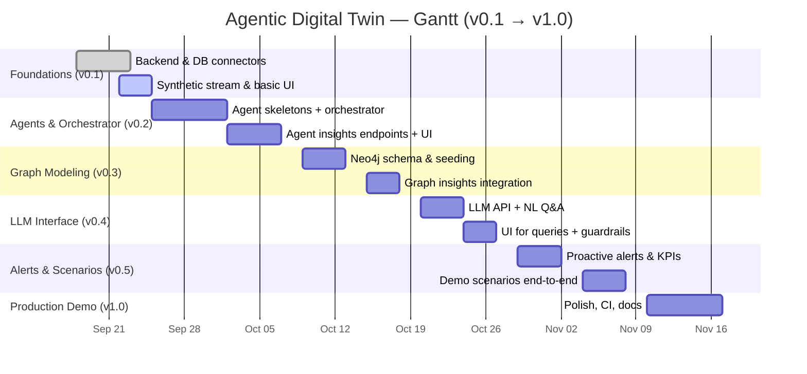

# Enterprise Digital Twin — Versioned Roadmap

This roadmap breaks down the build into clear, incremental versions with milestones and success criteria. It includes a Gantt chart for execution planning.

## Versions and Milestones

### v0.1 — Foundations (Week 1)
- Backend scaffold (`server/`): Express, Socket.io, TypeScript, env config
- Database connectors: MongoDB (time series), Neo4j (graph)
- Synthetic data generator streaming `SensorData` to Mongo + Socket.io
- Core domain types and schemas
- REST endpoints: health, sensor ingest/query, Cypher passthrough
- Frontend scaffold (`client/`): React TS + Vite + Tailwind + Recharts
- Basic dashboard rendering real-time ROP and simple alerts
- Docs: initial workflow and roadmap

Success criteria:
- `docker-compose up` starts Mongo + Neo4j
- `npm run dev` in server and client runs end-to-end stream + chart

### v0.2 — Agents & Orchestration (Weeks 2–3)
- Implement agent skeletons:
  - PerformanceMonitorAgent
  - FormationIntelligenceAgent
  - PredictiveMaintenanceAgent
  - DrillingStrategyAgent
- Orchestrator with conflict resolution and priority management
- Server endpoints to expose agent insights and orchestrated decisions
- Frontend panels: Agent status, Recommendations panel
- Enrich synthetic data with formation changes and degradation patterns

Success criteria:
- Orchestrator returns resolved recommendation based on multi-agent inputs
- UI displays agent activity and recommendations in real time

### v0.3 — Graph Modeling & Queries (Week 4)
- Neo4j schema: Well, Formation, Equipment, DrillingEvent, BitRun, Alert
- Migrations/seeding scripts for demo scenarios
- Graph queries powering insights (e.g., offset wells, formation sequences)
- Frontend visualization hooks to display relationship-driven insights

Success criteria:
- Graph queries demonstrate relationship-based insights supporting decisions

### v0.4 — LLM Interface & NL Queries (Week 5)
- LLM API integration (OpenAI) with domain prompt template
- Endpoint for natural language Q&A with context
- UI: “Ask the Twin” panel with threading/history
- Safety guardrails and prompt transparency

Success criteria:
- Common domain questions return coherent, grounded answers

### v0.5 — Alerts, KPIs, and Demo Scenarios (Week 6)
- Proactive alerts: ROP drops, vibration/torque spikes, formation change ahead, maintenance windows, cost overrun
- KPI tracking: real-time ROP, cost/ft, efficiency score, equipment utilization
- Three demo scenarios scripted end-to-end with toggles

Success criteria:
- Each scenario clearly demonstrates proactive intelligence and coordination

### v1.0 — Production-Ready Demo (Weeks 7–8)
- Polished UI/UX, responsive layouts, accessible color system
- Configurable data rates and scenario parameters
- CI: lint, typecheck, tests, build
- Docs: architecture, runbooks, scenario walkthroughs

Success criteria:
- Smooth demo with measurable impact metrics visualized

## Dependencies & Risks
- OpenAI key required for LLM features
- Local resources for MongoDB and Neo4j containers
- Performance tuning may be needed for higher data rates

## Gantt Chart

